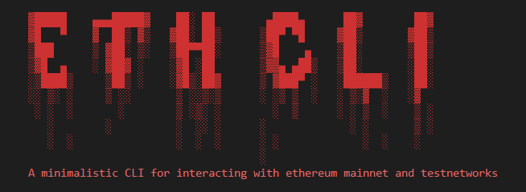
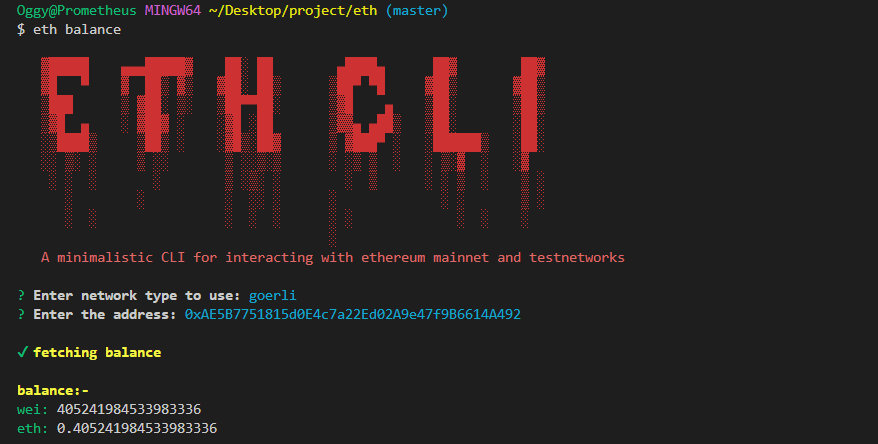
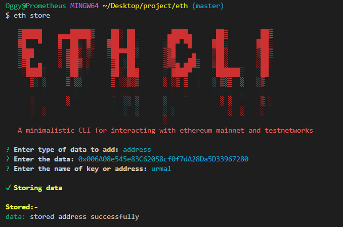
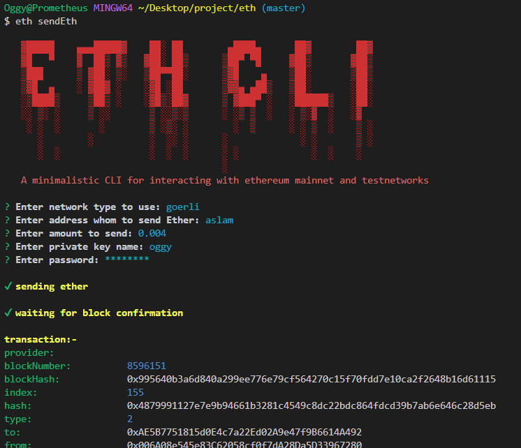
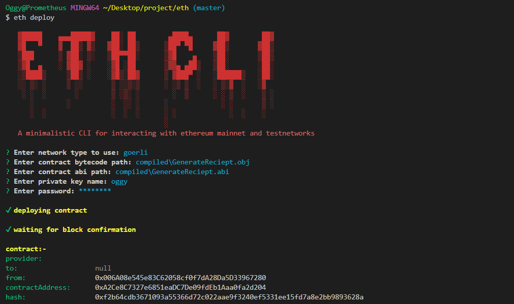

# A minimalistic CLI to interact with ethereum mainnet and testnets



## Install

make sure you have node, npm and yarn installed on your machine

* run following commands to install eth-cli globally on your local machine
    ```
    git clone https://github.com/oggy107/eth-cli.git
    ```
    ```
    cd eth-cli
    ```
    ```
    yarn install-globally
    ```

run `eth --version` command to check if eth-cli is installed properly


## Usage

```
Usage: eth {command name}

Options:
  -V, --version   output the version number
  -h, --help      display help for command

Commands:
  balance         get balance of address
  blocknumber     get latest block number
  block           get block data
  transaction     get transaction data
  compile         compile solidity smart contract. outputs abi and object code in compiled directory. currently compilation of solidity files without libraries(importing other      
                  solidity files) is supported
  deploy          deploy a contract
  interact        interact with already deployed contract
  sendEth         send ether to address
  store           store addresses and keys
  help [command]  display help for command
```

## Features

* ### **Minimalistic Interface**
    Easy to use and understand command line interface

* ### **Secure**
    The eth-cli stores the encrypted private keys which can only be accessed using secure password. The address and encrypted private keys are stored at `HOME_DIRECTORY/.eth-cli/` path

* ### **Usefull Commands**
    The eth-cli provided usefull commands which can be used to retrieve data and interact with blockchain easily. User can send eth, compile, deploy and interact with contracts.

* ### **Interact with any contract**
    The eth-cli provides a command to interact with any contract deployed over the network. You just need to create, compile and deploy contract and start interacting with it using eth-cli. You can virtually do anything using eth-cli what contract is capable of doing. *note: you need contract address and abi to interact with it*

* ### **Built in compiler**
    eth-cli comes with a build in solidity compiler

* ### **Pretified Output**
    Easy to read and formated JSON output of the commands

## Networks

Option to choose between networks pops before every command in ran.
*note: default selected network is **goerli testnet** to switch to mainnet use arrow keys to select **mainnet**. currently only **goerli** and **mainet** are supported*

## Getting help

* To get all available commands and their description
    ```
    eth [--help | -h]
    ```

## Using Commands

Run a command using `eth {command}` syntax. List all the available commands using `eth --help | -h` 
After writing a command to use press enter and answer the followup questions

**Note:**
`eth store` command can be used to store pirvate keys and addresses such as public address, contract address, transaction hash, block hash, etc in key value pairs.
The key can be used later in questions to make things easy. Storing private keys need a password and you need to supply password everytime you use your private key

## Examples

* Get balance of address
    ```powershell
    eth balance
    ```
    output

    

---

* Storing address or private keys
    ```
    eth store
    ```
    output

    

---

* Sending ether (using stored address)
    ```
    eth sendEth
    ```
    output

    

---

* Deploying a smart contract on goerli testnet (using stored private key)
    ```
    eth deploy
    ```
    output

    